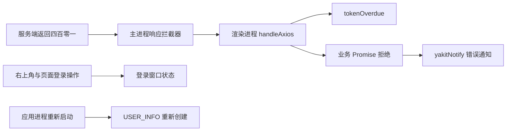

## 项目上下文摘要（本地社区版令牌会话）

生成时间：2026-07-21 15:52:48 +08:00

### 1. 需求与验收条件

- 目标：本地社区版用户在一次应用启动期间成功登录后，服务端返回 `token过期` 不得清除当前用户状态，也不得形成登录失效通知。
- 登录入口：应用启动后处于未登录状态时，右上角入口与页面重新认证操作必须能够开启现有登录窗口；已经登录时不得重复开启。
- 生命周期：主进程内存中的用户对象限定本次应用进程；关闭并重新开启应用后，该对象重新创建，失效的持久令牌会被启动认证流程清除，此时允许重新认证。
- 产品边界：社区账号保留会话；`company` 平台账号仍执行既有失效退出流程，避免改变企业版认证语义。
- 请求语义：业务请求仍以拒绝结果结束，页面加载状态可正常终止；只静默本次进程中已明确保留会话后的过期错误通知。

### 2. 当前数据流与问题位置

- `app/main/httpServer.js` 当前在四百零一响应中直接返回 `USER_INFO`，不会区分社区账号与企业账号。
- `app/renderer/src/main/src/services/fetch.ts` 当前将 `tokenOverdue` 设为空函数，因此企业账号也失去原有退出语义。
- `app/renderer/src/main/src/pages/plugins/utils.ts` 的审核列表与审核统计仍把 `token过期` 拼入错误通知，形成截图中的红色提示。
- `LoginRequiredState` 发送 `RENYAN_SHELL_EVENTS.openLogin`，但现有菜单监听器没有处理该值；原测试只证明事件发送，没有证明窗口开启。

### 3. 相似实现分析

- `app/renderer/src/main/src/pages/plugins/utils.ts` 的 `apiFetchOnlineList`：在展示错误前排除精确的 `token过期` 字符串，证明业务上已有静默此原因的约定。
- `app/renderer/src/main/src/pages/plugins/utils.ts` 的 `apiFetchGroupStatisticsOnline`：统计请求采用相同排除规则，说明列表与统计应保持一致。
- `app/main/state.js` 的 `createUserInfo`、`resetUserInfo` 与 `expireUserInfo`：用户状态是主进程模块内对象，适合表达单次应用进程生命周期，不需要持久化新的标志。
- `app/renderer/src/main/src/components/layout/FuncDomain.tsx`：右上角未登录图标、通知区域和现有 `Login` 组件已经具备直接开启窗口的能力，可复用同一状态控制。
- `app/renderer/src/main/src/components/yakitUI/RenyanState/LoginRequiredState.tsx`：页面重新认证操作已采用全局事件总线，缺少的部分是窗口状态监听。

### 4. 项目约定与复用组件

- 命名采用大驼峰组件、小驼峰函数；格式采用两个空格、单引号、无分号和尾随逗号。
- 复用 `USER_INFO`、`expireUserInfo`、`NetWorkApi`、`yakitNotify`、`Login`、全局事件总线与 `RENYAN_SHELL_EVENTS.openLogin`。
- 不增加第三方依赖，不改变登录协议、持久令牌位置、页面路由或在线 API 数据结构。
- 测试位于相邻 `__test__` 目录，使用 Vitest、测试库与真实事件总线；仅桌面桥接和通知展示边界使用测试替身。

### 5. 测试策略

- 主进程状态测试覆盖社区账号保留、企业账号退出、未登录启动状态三个分支，并检查返回给渲染进程的用户快照不含令牌。
- 渲染进程测试覆盖社区会话静默过期通知、普通错误仍展示、企业账号仍执行本地退出与全局退出。
- 登录窗口钩子测试覆盖未登录直接开启、事件开启、已登录禁止开启、登录状态改变后关闭窗口。
- 基线测试已执行：两份测试文件、三项用例成功；存在 React 旧渲染 API 与 Node.js `punycode` 的既有弃用警告。

### 6. 外部资料与工具状态

- 代码索引包含一千七百七十三个文件，调查时状态有效；索引提示的临时变化均位于无关生成文件或人工智能页面，不影响本任务证据。
- 代码托管搜索服务因匿名访问频率限制拒绝请求，未取得外部实现；本任务采用仓库内两个既有静默模式与当前认证链路作为依据。
- 编程文档检索服务当前未提供；本任务没有引入或改变第三方库用法，因此不采用网页资料替代。
- 结构化任务管理服务当前未提供；使用项目计划与内置计划状态记录替代。

### 7. 充分性检查

- 接口契约：已明确。四百零一结果增加布尔状态，渲染进程据此决定保留或退出；请求仍返回拒绝结果。
- 技术选择：已明确。主进程对象表达应用进程生命周期，渲染端模块状态表达本次页面生命周期，登录事件由专用钩子统一处理。
- 主要风险：企业认证语义被误改、普通错误被误静默、登录事件监听泄漏、启动认证被错误视为已登录；均有独立测试分支。
- 验证方式：已明确。定向测试、完整类型检查、目标代码规范检查、格式检查、差异空白检查与代码索引同步共同提供证据。
